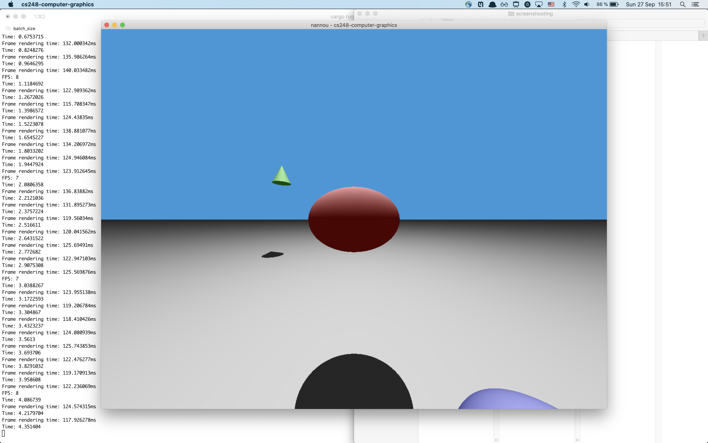
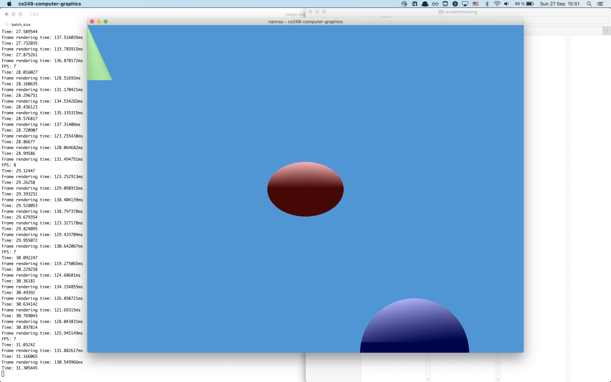
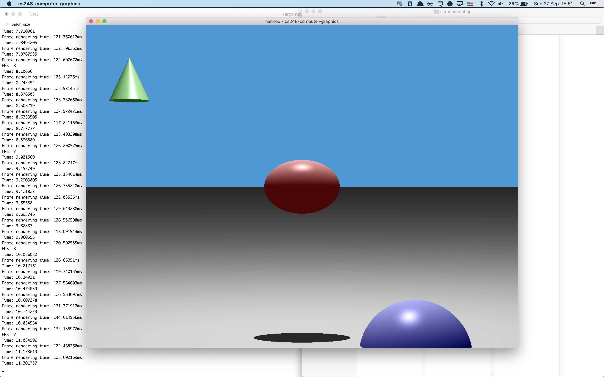
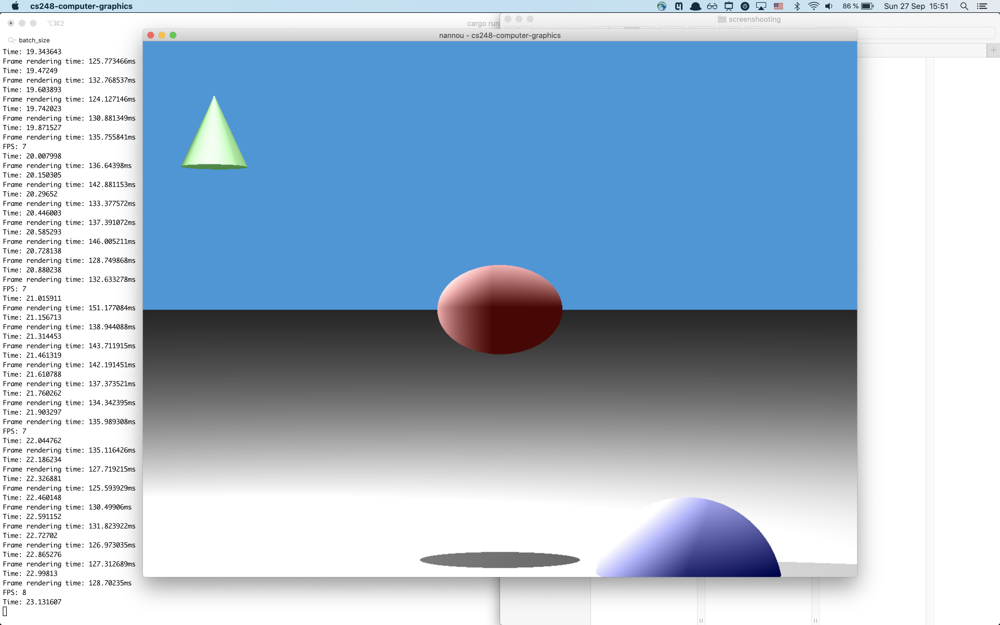

# CS248 Computer Graphics course
My homework assignments for CS248 Computer Graphics course at KAUST 2020 Fall.

## Assignment 1


### Scene description
We have a sphere (center is `(x: 1.0, y: -1.5, z: -0.5)`), ellipsoid (centered at `(x: 0.0, y: 0.0, z: 0.0)`), cone (with apex at `(x: -2.0, y: 1.5, z: 2.5)`) and plane (given by `y = -1.4`) rendered on the scene.
We have two light sources from above and from the left (you can switch on the second one with `L`).
We render the scene with perspective projection with camera positioned at `z = -1`. You can switch to `z = -10` with `Z` key.
Sphere is positioned in such a way that is partially under the floor.

Example images are located in `images/assignment-1` directory.


### How to run the code
You need to [install Rust on your system](https://www.rust-lang.org/tools/install) and then just type the command:
```
cargo run --release
```

The binary file will be located at `target/release/cs248-computer-graphics`.
The binary compiled on OS X Catalina 10.15.6 is located at `cs248-computer-graphics`.

### Additional features implemented (for the remaining 20% of the full grade):
- all 4 object types (instead of just 3): sphere, ellipsoid, cone and plane.
- cone is finite and has the slab (i.e. a disk underneath which bounds it from below — like for a cylinder)
- specular lighting
- multiple light sources
- key controls:
    - press `P` to switch between projection types
    - press `L` to switch between number of light sources (1 or 2)
    - press `S` to enable/disable specular lighting
    - press `Z` to switch between far away and close-up camera view (`z = -10` and `z = -1`)
- render everything "online" (instead of saving to an image)
- good FPS even for 1280x960 resolution (in my case, it is 8 for 1280x960 resolution)
- parallel execution
- unit tests
- everything is implemented in Rust, which makes the program more robust

### Screenshots





### Profiling
The scene is rendered at 7.7 FPS.
Rendering of a single frame takes `~130ms~` on my system.
Parallel executation speeds up rendering twice.

### Technologies used
In the assignment, were used the following libraries:
- [nannou](http://nannou.cc/) to open a window and detect key press events, which is an analog of OpenFrameworks for Rust language
- [image](https://crates.io/crates/image) to save an image
- [rayon](https://crates.io/crates/rayon) which provides easy-to-use parallelism for Rust

## Hardware used
All experiments are done on MacBook Pro 16' with 2,3 GHz 8-Core Intel Core i9.
