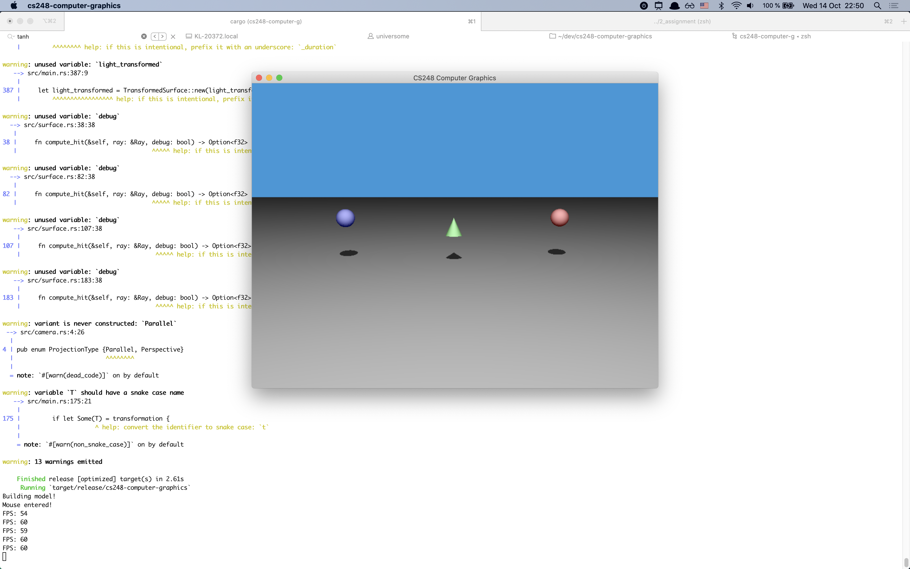
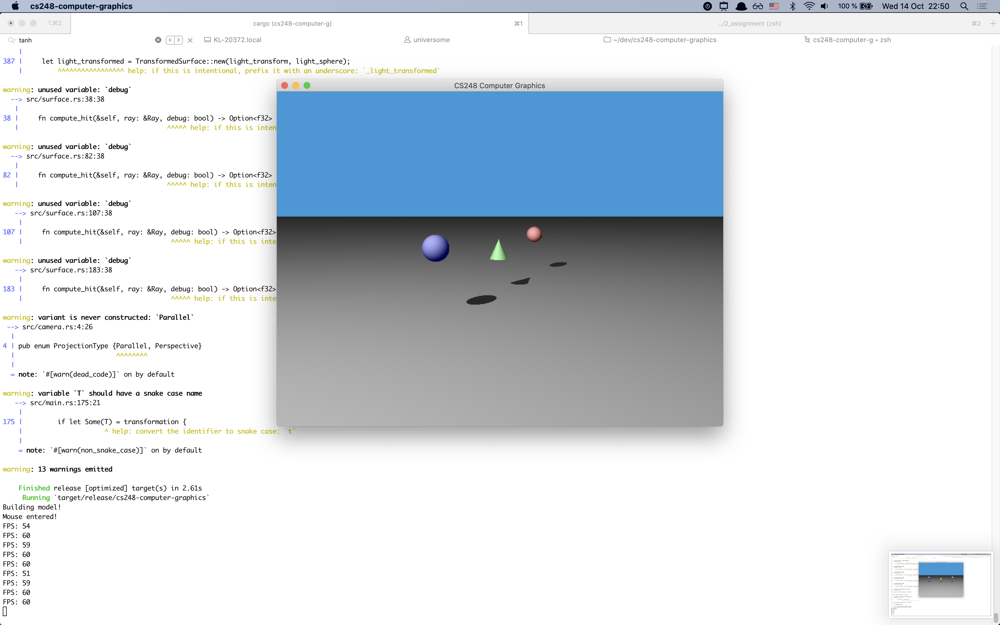
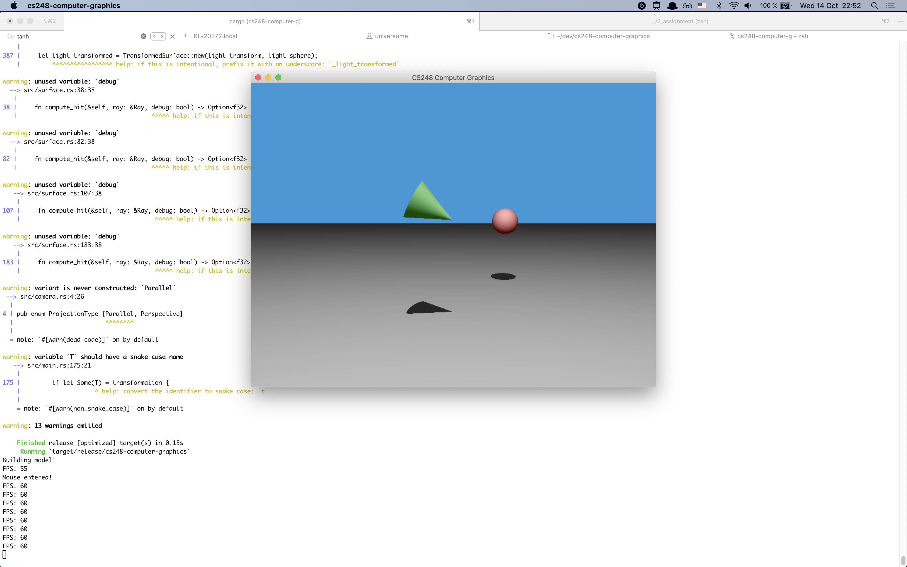
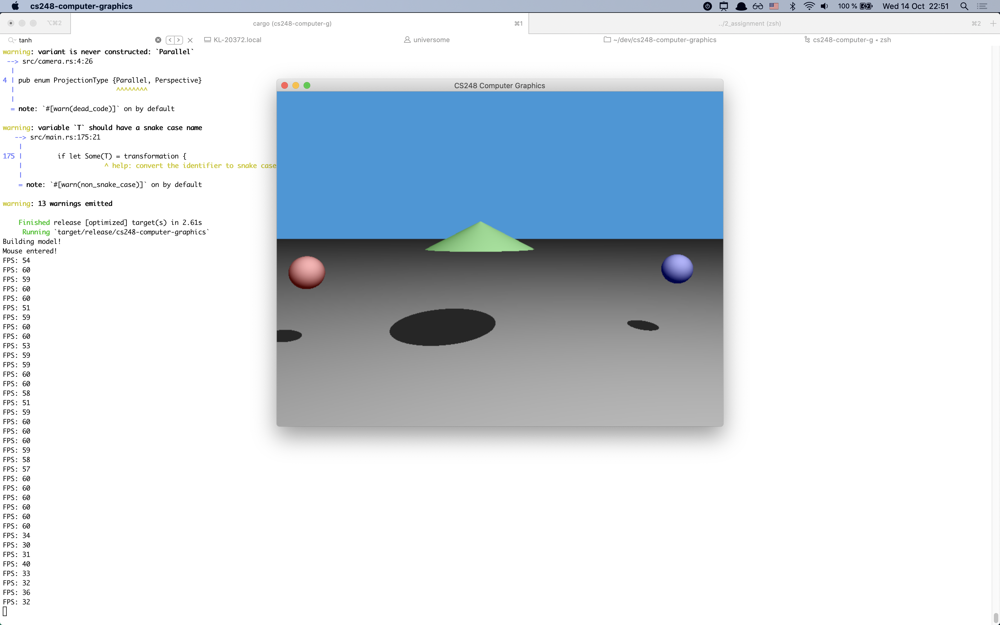
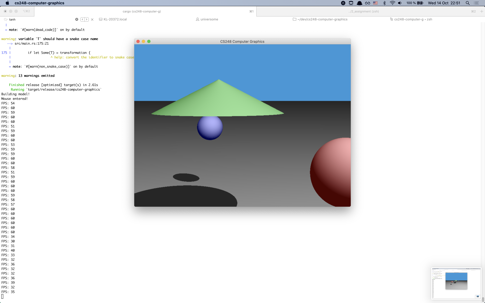
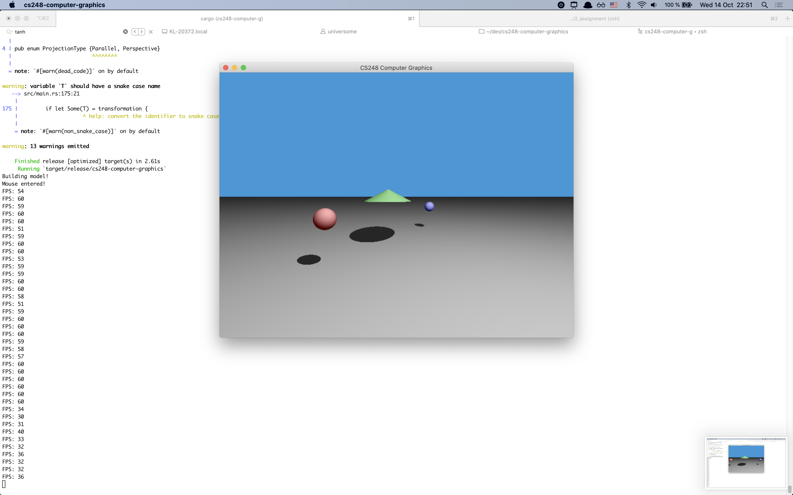

## Assignment 2



### Scene description
We have a cone (centered at `(0.0, 0.0, 0.0)`) and two sphers round around.
We have a light source from them.
Example images are located in `../images/assignment-1` directory.

### Controls
- Mouse movement + `W`/`A`/`S`/`D` — move camera
- Mouse scroll — zoom in and zoom out
- Mouse click — select an object
- `L` — select the light source
- Top/down/left/right — move the selected object parallel to the viwwing plane
- `I`/`O`/`P` — rotate an object across x/y/z axis
- `1`/`2`/`3` + up/down arrow — scale object across x/y/z dimension
- `Q` — set everything to default

### How to run the code
You need to [install Rust on your system](https://www.rust-lang.org/tools/install) and then just type the command:
```
cargo run --release
```

The binary file will be located at `target/release/cs248-computer-graphics`.
There is also a binary attached which is located at `cs248-computer-graphics` (Note: compiled on OS X Catalina 10.15.6).

### Additional features implemented (for the remaining 20% of the full grade):
- full camera movement
- zoom in/zoom out
- light movement
- simple transitions (spheres flying around)
- optimized performance for better interactivity: 60 FPS on 960x720 (on my laptop, but drops to 15 FPS when the laptop gets heated up)

### Screenshots





