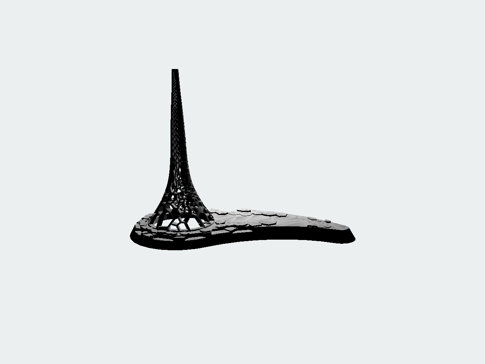
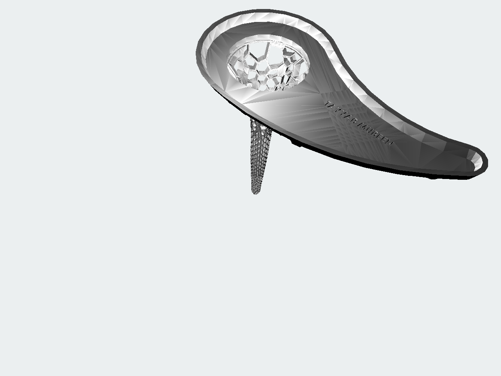
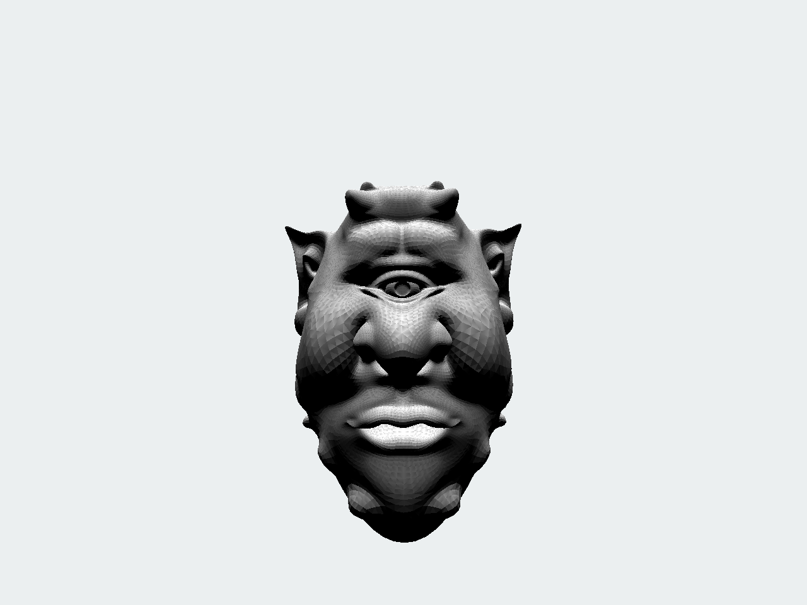
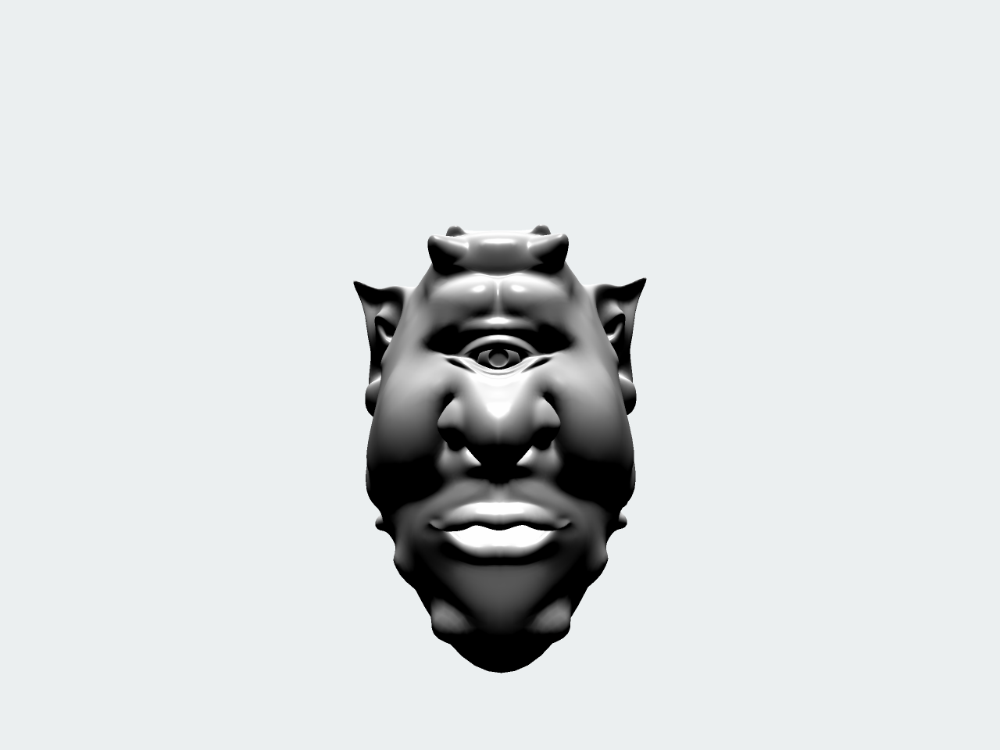

## Assignment 3



### Scene description
I implemented the rasterizer which takes either KAUST Beacon model or face model obj as input as renders.
You can pass other models as well, but you would need to specify a camera distance for them then.

### Controls
- Mouse scroll — zoom in and zoom out (but no cliping is implemented so zoom at your own risk)
- Mouse click and move — arcball rotation of the object
- `L` — switch between Gouraud and Phong shading (Phong shading works only if your obj file specifies normals)
- `T` — enable texture mapping with stripe effect
- `A` — enable/disable antialiasing via supersampling
- `Q` — enable/disable specular lighting
- `S` — save the current frame

### How to run the code
You need to [install Rust on your system](https://www.rust-lang.org/tools/install) and then just type the command:
```
cargo run --release MODEL_PATH
```
where `MODEL_PATH` is either `resources/KAUST_Beacon.obj` or `resources/bs_ears.obj`.

The binary file will be located at `target/release/cs248-computer-graphics`.
There is also a binary attached which is located at `cs248-computer-graphics` (Note: compiled on OS X Catalina 10.15.6).

### Additional features implemented:
- phong shading
- simple antialisasing (via supersampling)
- zoom-in/zoom-out (_without_ clipping)
- specular lighting (for both Gouraud and Phong)
- texture mapping with stripe effect
- backface culling

### Screenshots



