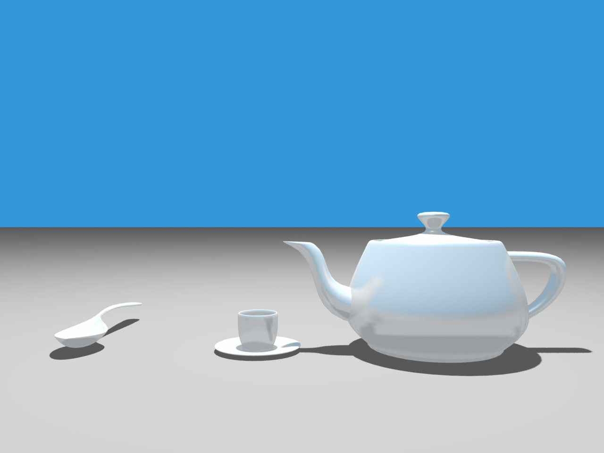

## Assignment 4



### Scene description
There are 3 scenes implemented:
1. Two rotating spheres — to test reflection/soft shadows since they are fast to render
2. Simple teapot — a low-polygon teapot to show some of the features for meshes.
3. Newell teaset — a higher-polygon meshes just because they look nicer.

### Controls
- Mouse scroll — zoom in and zoom out (but no cliping is implemented so zoom at your own risk)
- Mouse movement + `W`/`A`/`S`/`D` — move camera
- `1`/`2`/`3` — switch between the scenes
- `F`/`G` — switch back and forth between provided/precomputed/face normals
- `I`/`O`/`P` — enable/disable supersampling/soft shadows/glossy reflection
- `Arrow Up`/`Arrow Down` — change the visibility level for the BVH
- `B` — switch forth between bbox/sphere/none bounding volume type
- `Q` — reset the scene

### How to run the code
You need to [install Rust on your system](https://www.rust-lang.org/tools/install) and then just type the command:
```
cargo run --release
```

The binary file will be located at `target/release/cs248-computer-graphics`.
There is also a binary attached which is located at `cs248-computer-graphics` (Note: compiled on OS X Catalina 10.15.6).
But you will need the `resources` directory from this repo.

### Features implemented:
- triangle meshes rendering
- precomputing normals for triangle meshes
- sphere/bbox bounding volumes for faster rendering
- BVH construction for spheres/bboxes
- supersampling via distributed RT
- soft shadows
- glossy reflections
- simple visualization of the BVH
- key controls for the above features
